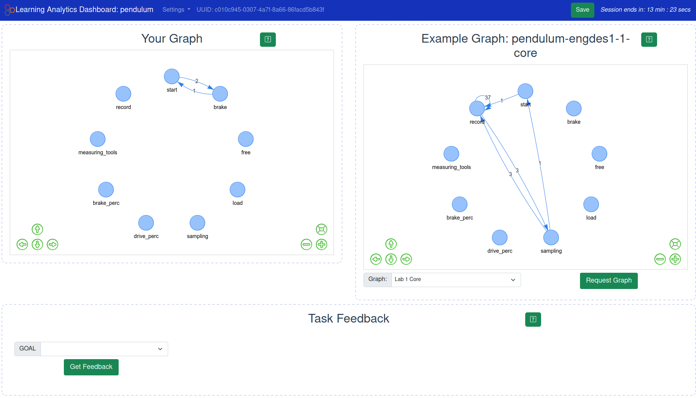
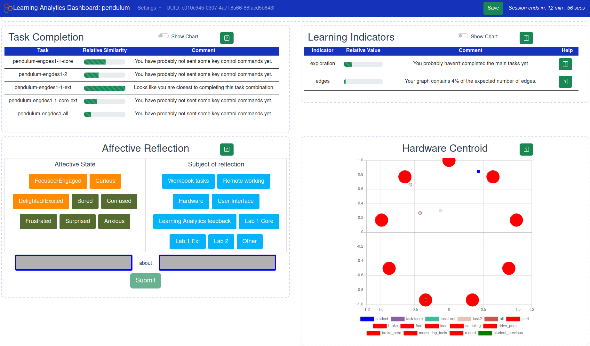

# Learning analytics client


This project provides a set of scripts for adding graph based learning analytics (LA) to the practable.io remote labs. The scripts utilise the same [relay](https://github.com/practable/relay) used to communicate with individual remote lab experiments, but use a separate websocket connection (in addition to data and video websockets) for two way communication using JSON strings between these analytics scripts running on a server and the analytics dashboard that users interact with. 

LA is used in this context to provide formative feedback to student users of remote labs. Details of the design and an evaluation of the system will be available in a future publication, soon to be submitted to IEEE Learning Technologies.





# Setup

A detailed example of how to setup the analytics server is given in [SETUP README](./setup/README.md).

A basic overview of setting up on AWS server.

### 1) Create and setup AWS server

t2.medium is the recommended minimum. Currently using a t2.medium server with 30Gb of storage. Each Python process only requires ~1% of CPU even when logging at high frequency (every 50ms). On startup of the Python scripts they can use a larger percentage of RAM, therefore it is recommended to start scripts in small batches (5-10 scripts at a time). To get running I set HTTP, HTTPS, SSH (for logging in to EC2 instance locally) and All TCP were set in the inbound security settings. Will need to check the security of all this and exactly what is necessary. Connection through the websocket was not allowed until I set All TCP.

### 2) systemd service files

The [configure](./setup/scripts/configure) script is used to generate appropriate access files and tokens on your local machine. This includes a systemd service file for each remote lab experiment that sets the logging URL, data and comparison graph directory environment variables and starts a separate client script for each remote lab instance. These can then be moved to the appropriate location on the server.

This requires access to the necessary secrets provided by your administrator and they should be available on your local machine at ```$HOME/secret/sessionrelay.pat``` for example.

### 3) run session-rules

A session-rules script needs to be created for the custom set of remote lab hardware you wish to connect to. See example in [example session-rules script](./setup/files/session-rules)

### 4) Start scripts on server

The above scripts need to be transferred to the server along with the analytics python scripts. Python scripts should be located in `/opt/analytics/`, so that the comparison graphs are at `/opt/analytics/comparison_graphs` and a data folder needs to be created at `/var/analytics/data/` (these are the default directory paths in the scripts) where user adjacency matrices are stored.

Use systemctl to enable and start session-rules and the individual experiment scripts. The configure script will create an `enable-logging-clients.sh` and `disable-logging-clients.sh` script.


## JSON command format

Individual remote lab UIs send analytics data with the following JSON format:

```
{
    user: uuid,           //unique user ID that is stored in localStorage
    t: Date.now(),              
    exp: exp,             // the remote lab experiment e.g. spinner or pendulum
    hardware: hardware,   // the specific implementation of a remote lab e.g. spin30, pend00
    course: course,       // the course code the remote lab is being used with e.g. engdes1, cie3 or everyone (for public acccess)
    type: "analytics",          // only logs with this type will be used by the analytics client.
    payload: payload            // specific to the log being made - most likely details of the command and parameters set in the UI.
}

 ```
 Where ```type``` is either "log" (which will be ignored by the analytics client but accepted by the logging client); "analytics" for processing new data to a user; or "request" for returning the analytics data to a user dashboard.

The analytics dashboard requests data using the following format:

```
{
    user: state.uuid,
    t: Date.now(),          
    exp: state.exp,   
    course: state.course, 
    type: "request",            //NOTE: the request type
    payload: payload   
}       
```
Where the payload field contains a content field:

e.g.
```
{"content": 'all_feedback', "graph": 'spinner-cie3-1-2'}
```

# Scripts

The `client.py` script is the main script that needs to be started by systemd for each lab implementation. This script connects to that specific piece of hardware's logging websocket and listens for messages being sent. 

When it receives `type: analytics` messages it will add the new data to the graph for the associated UUID.
When it receives `type: request` messages it generates a response and returns this on the same websocket for communication with the user interface connected to that piece of hardware.
There is also a `type: feedback` message for logging specific student feedback that can be logged from the analytics dashboard.

### Requests

The majority of the analysis of data is performed when a `request` for analytics is received. The request will initially call an appropriate method from `response.py` depending on whether the request is for a graph or some other learning indicator. Typically, the response method will call another method in `analytics.py` in order to calculate the learning indicator and/or a method in `process.py` to generate the necessary graph data. The processed response is then returned to the user via websocket in the original `client.py` script where the request originated.

The analytics scripts do not generate HTML (or any other format) other than JSON strings. Creation of the graph content is done on the client side in the learning analytics dashboard app, using the graph properties sent to it in the JSON response.